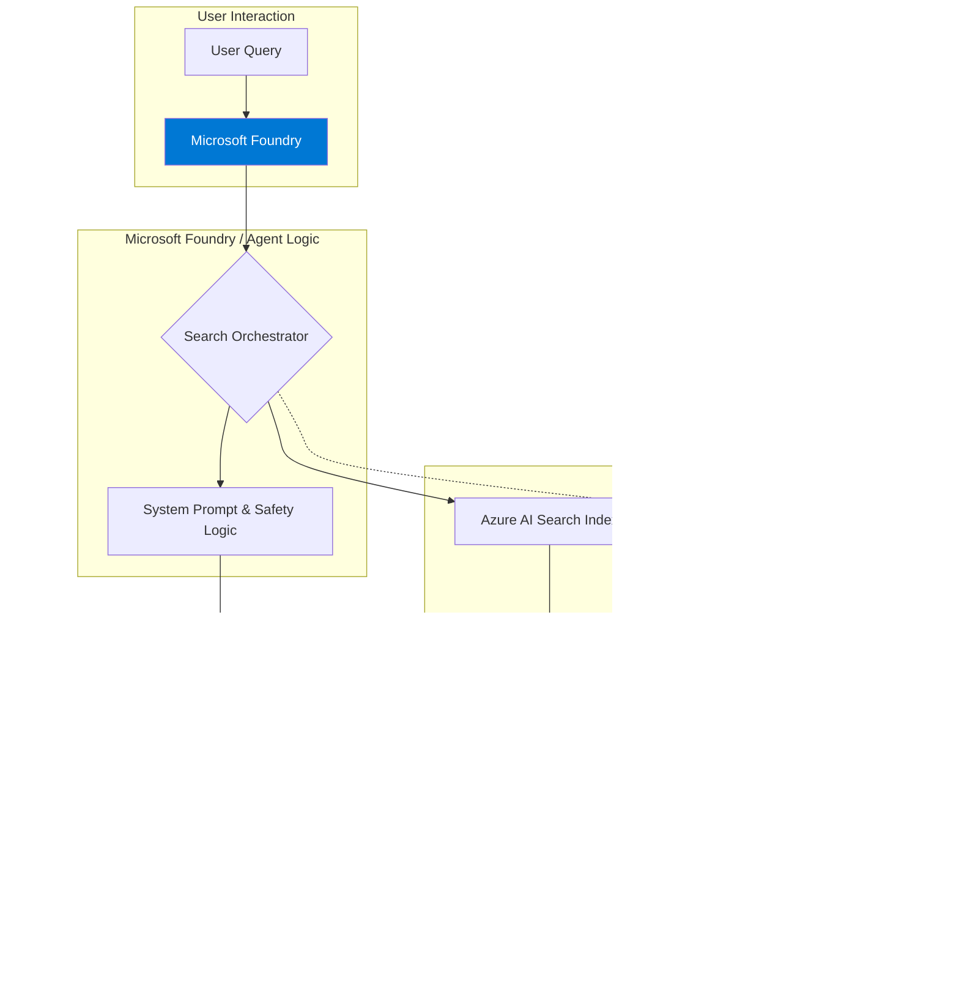

```mermaid
graph TD
    subgraph User_Layer [User Interaction]
        A[User Query] --> B[Microsoft Foundry]
    end

    subgraph Orchestration_Layer [Microsoft Foundry / Agent Logic]
        B --> C{Search Orchestrator}
        C --> D[System Prompt & Safety Logic]
    end

    subgraph Data_Layer [Knowledge Retrieval]
        C --> E[Azure AI Search Index]
        E --- F[(Internal IT Knowledge Base)]
        C -.-> G[Web Search - Grounding with Bing]
    end

    subgraph Reasoning_Layer [LLM Processing]
        D --> H[GPT-4.1-mini]
        H --> I[Response Generation]
    end

    subgraph Output_Layer [Final Output]
        I --> J[Answer + Citations]
        I --> K[Safety Disclaimer]
    end

    %% Security Styling
    style B fill:#0078d4,color:#fff
    style F fill:#f2f2f2,stroke:#333
    style G fill:#fff,stroke-dasharray: 5 5
```
## *SECURITY NOTE*
All data retrieval happens within the encrypted Azure Tenant boundary using Managed Identities to ensure Zero-Trust security."
